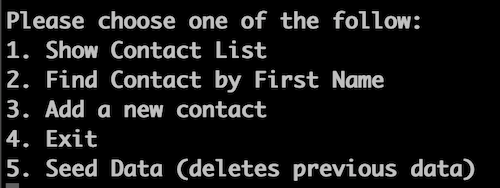

# Python-Command-Line-Project

## Description

This is a small program written in Python to be used as a sort of address book for a single user. Currently each item can store a name, phone number and an address. All data is stored is set up to be stored in a Postgres database. Most of the heavy lifting is done by a switch style statement which makes the application quite modular.

## Requirements

- [Postgres](https://www.postgresql.org/)
- [Python3](https://www.python.org/)
- [Pipenv](https://pypi.org/project/pipenv/)

## Installation

After downloading this repo, you'll need to install dependencies using the following commands from the `lib` directory:

`pipenv install`

Next you will need to initialize the database. The easiest way to do this is via the command line with the follow:

`createdb contacts`

If you use a diferent database name, you'll need to adjust the code to match it.

## Usage

To run the program, you'll need to use the following command in the `lib` directory.

`pipenv run python main.py` 

There are currently five menu items:

If you'd like to add a couple of entries into the database, you can select option 5. This option will also clear out any previous data. You can remove this option if you don't need it. The other options are self explanitory.

## Future updates

I'm currently working on a GUI using PySimpleGUI and that is currently being done in the development branch. Once that is done, I'll look at fleshing out more fields that can be used for each entry into the database.

## Author

William Chrapcynski: All code